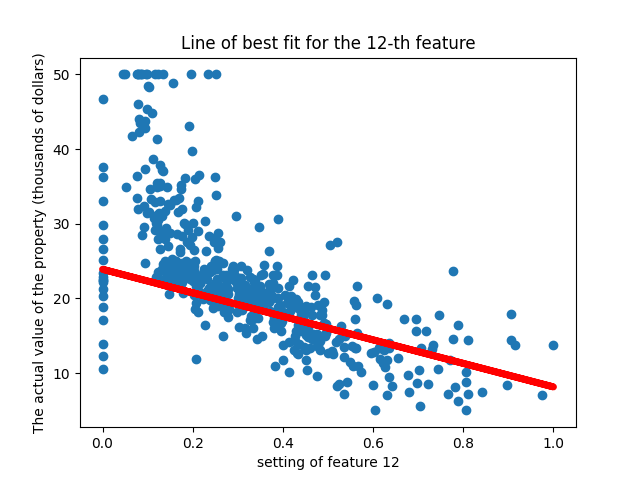

# Experimental of Data Learning with Linear Regression

---
This a python progarm that takes in a set of real life data and try to produce a line of best fit for the data. 
Any following assignment will focous on Supervised Learning including Loss function and Gradient Descent.  
  

  
Line of best fit, or Linear Regression are perfect problem to tackle with supervised learning. The main goal is to produce
a linear function, which predict the future data based on the set of data given. If there is any additonal data plot into the
set, this line will be able to predict that data and be near that data. 
  
**1.** First we defined a learning model. A model are similar to a function, which requires an input and parameters. 
  
$$\hat{y} = \sum_{i=1}^N w_i \cdot x_i + b = X \cdot W + b$$
  
The output $\hat{y}$ are sum of all $x_i$ input mutilple with $w_i$ weight plus $b$ a bias. In another words, the output are 
dot product of $X$ the input with $W$ and $b$ weight and bias as parameters in our model. This output or `Label`, are our 
initial prediction of our dataset and it does not perform well. However we can train the model with our given dataset by 
using loss function  
  
**2.** After we defined a learning model, we then uses a loss function to determin the accuacy of our line. There are many
methods we can determine it but in my progarm I used *Mean Square Error* (MSE) which are defined as:  
$$MSE(y, \hat{y}) = \frac{1}{N}\sum_{i=1}^N(y^{n} - \hat{y}^{n})^2$$  
we can calculate the difference between the output of our previous model $\hat{y}$ with regard to $y$ the actual data. By finding
how bad our model is performing. Then we can adjust the parameters to find a model perform the best, by having the lowerst loss. 
The act of finding a minimum value based of a function, or, finding global minimum are also known as Gradient descent.  

This is the first coding project in Computer Science 389 Intro to Machine Learning at University of Massachusetts of Amherst.
This file was originally created by class instrusctor Cooper Sigrist, completed and documented by Fengkai Lin.
